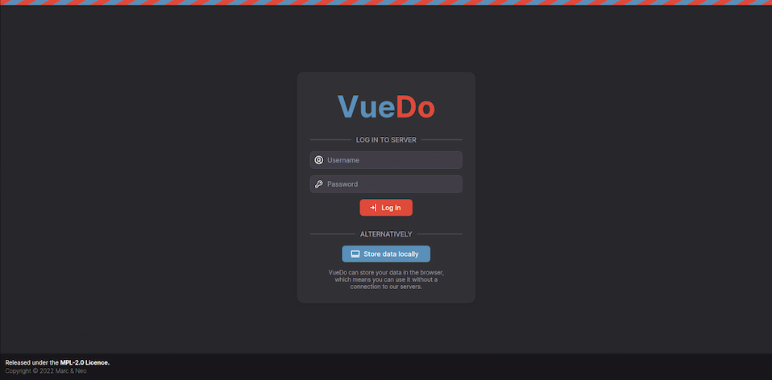

# Vue-Do

## Projekt setup
```
$ npm install
```

### Kompilieren und hot-reloads für Produktion
```
$ npm run dev
```

### Kompilieren und komprimieren für Produktion
```
$ npm run build
```

### Startet Cypress Tests
```
$ npm run cy
```

## Konzept
Als Schulprojekt haben Neo (@justablob) und Marc (@marcmatter) eine Todo Web-App erstellt.
Dabei wurden moderne Web Technologien wie [Typescript](https://www.typescriptlang.org/) und [Vue.js](https://vuejs.org/) 
eingesetzt. Das Ziel von VoDo ist eine möglichst simple und optisch ansprechene Todo App zu bieten, welche im Alltag einfach auf einem Mobil- oder Desktopgerät verwendet werden kann.

|             | Mockup                                                          |
|-------------|-----------------------------------------------------------------|
| Login Seite |  |
| Startseite  |   |


## Zeitplan
### Phase 1 [12.04.22 - 25.04.22]
- [x] eslint Konfiguration
- [x] tailwind Konfiguration
- [x] Repository auf Github erstellen.

### Phase 2
- [x] Basis Komponenten erstellen z.B. BaseButton, BaseInput,...
- [x] Login Seite integrieren.
- [x] Primitives Startseite Ui.

### Phase 3
- [x] Implementierung State Management Bibliothek [pinia](https://pinia.vuejs.org/).
- [x] Abschluss Startseite.

### Phase 4
- [x] Mobilansicht verbessern.
- [x] Diverse Design verbesserungen.
- [ ] Drag and Drop Aktionen.
- [ ] Cypress Test Scripts.

Weitere informationen -> [Changelog](./documentation/changelog.md)

## Vergleich mit Mockup und Endresultat
|             | Mockup                                                          | Resultat                                                        |
|-------------|-----------------------------------------------------------------|-----------------------------------------------------------------|
| Login Seite |  |  |
| Startseite  |   |   |

## Browser Tests

|                                          | Chrome | Firefox | Safari |
|------------------------------------------|--------|---------|--------|
| Login Seite                              |        |         |        |
| Startseite                               |        |         |        |
| [cypress](https://www.cypress.io/) Tests |        |         |        |

## Funktiontests mit [cypress.io](https://www.cypress.io/)


## Feedback 
### - Neo (@justablob)

### - Marc (@marcmatter)
