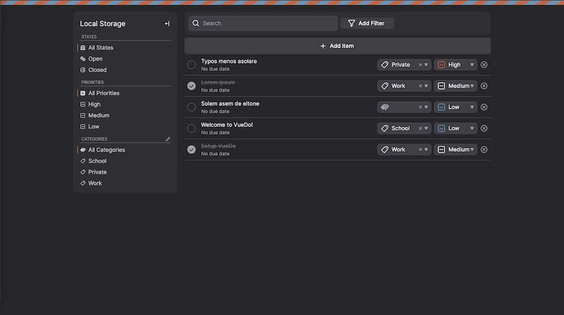

# Vue-Do

## Konzept 📝
Als Schulprojekt haben Neo ([@justablob](https://github.com/justablob)) und Marc ([@marcmatter](https://github.com/marcmatter)) eine Todo Web-App erstellt.
Dabei wurden moderne Web Technologien wie [Typescript](https://www.typescriptlang.org/) und [Vue.js](https://vuejs.org/) 
eingesetzt. Das Ziel von VoDo ist eine möglichst simple und optisch ansprechende Todo App zu konstruieren, welche im Alltag einfach auf einem Mobil- und Desktop geräten verwendet werden kann.

|             | Mockup                                                            |
|-------------|-------------------------------------------------------------------|
| Login Seite |   |
| Startseite  |  |

## Zeitplan ⏰
### 1️⃣ Phase [25.02.22 - 29.02.22]
- [x] ESlint Konfiguration
- [x] tailwindcss Konfiguration
- [x] Repository auf Github erstellen.

### 2️⃣ Phase [29.02.22 - 08.03.22]
- [x] Basis Komponenten erstellen z.B. BaseButton, BaseInput,...
- [x] Login Seite integrieren.
- [x] Primitives Startseiten Ui.

### 3️⃣ Phase [08.03.22 - 22.03.22]
- [x] Implementierung State Management Bibliothek [pinia](https://pinia.vuejs.org/).
- [x] Abschluss Startseite.

### 4️⃣ Phase [22.03.22 - 29.03.22]
- [x] Mobilansicht verbessern.
- [x] Diverse Design verbesserungen.
- [ ] Drag and Drop Aktionen.
- [x] Cypress Test Scripts.

## Vergleich mit Mockup und Endresultat 🔎
|             | Mockup                                                            | Resultat                                                          |
|-------------|-------------------------------------------------------------------|-------------------------------------------------------------------|
| Login Seite |   |   |
| Startseite  |  |  |

## Browser Tests 👨‍🔬

|                                          | Chrome 99 | Firefox 91 | Safari 15.3 |
|------------------------------------------|-----------|------------|-------------|
| Login Seite                              | ✔         | ✔          | ✔           |
| Startseite                               | ✔         | ✔          | ✔           |
| [cypress](https://www.cypress.io/) Tests | ✔         | ✔          | ✔ Manuell   |

## Funktionstests mit [cypress.io](https://www.cypress.io/) 🤖

-> [⚙️ Letzte Github Cypress Workflows](https://github.com/marcmatter/vue-do/actions/workflows/main.yml)

### Cypress Test starten 🏃‍♂️
- Headless:
  `
  $ npm run cy:run
  `
- Ui interface:
  `
  $ npm run cy:open
  `

create entries
- ✓ login with localstorage (3793ms)
- ✓ check initial entires (208ms)
- ✓ create entry (2776ms)
- ✓ check new entry (296ms)

filter entries
- ✓ login with localstorage (3255ms)
- ✓ check initial entires (159ms)
- ✓ filter entries state open (712ms)
- ✓ filter entries state closed (724ms)
- ✓ filter entries priority high (440ms)
- ✓ filter entries priority medium (628ms)
- ✓ filter entries priority low (699ms)
- ✓ filter entries category school (1457ms)
- ✓ filter entries category work (1219ms)
- ✓ filter entries category private (871ms)

manage categories
- ✓ login with localstorage (3484ms)
- ✓ check initial entires (130ms)
- ✓ add new category (1473ms)
- ✓ assign entry to new category (1031ms)
- ✓ filter new category (457ms)
- ✓ check unable to delete category with assigned entry (529ms)
- ✓ delete category (499ms

## Feedback 💬
### - Neo (@justablob)

### - Marc (@marcmatter)
